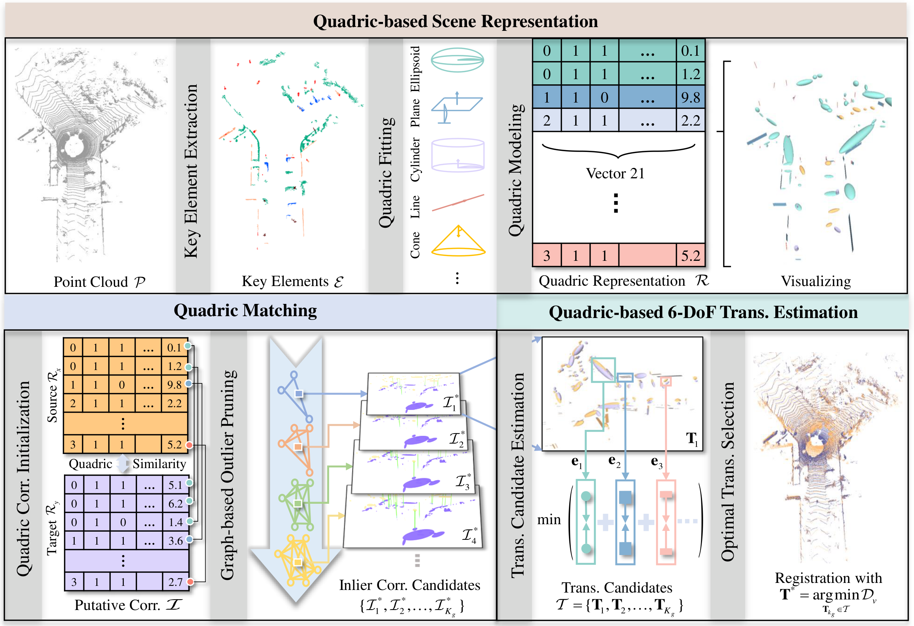

<div align="center">

  

  ---

  [](https://doi.org/10.1109/TRO.2026.3686263)
  [](https://arxiv.org/abs/2412.02998)
  [](https://levenberg.github.io/QuadricsReg/)
  [](LICENSE)

  **QuadricsReg: Large-Scale Point Cloud Registration using Semantic Quadric Primitives**

  *IEEE Transactions on Robotics (T-RO), 2026*

  [Ji Wu](https://scholar.google.com/citations?user=vbqIjH0AAAAJ&hl=zh-CN) &nbsp;&nbsp; [Huai Yu](https://levenberg.github.io/) &nbsp;&nbsp; [Shu Han](http://www.captain-whu.com/en/team/) &nbsp;&nbsp; [Ximeng Cai](http://www.captain-whu.com/en/team/) &nbsp;&nbsp; [Mingfeng Wang](http://www.captain-whu.com/en/team/) &nbsp;&nbsp; [Wen Yang](https://scholar.google.com.hk/citations?user=-aVL-UQAAAAJ&hl=en) &nbsp;&nbsp; [Gui-Song Xia](https://scholar.google.com/citations?user=SAUCVsEAAAAJ&hl=en)

  <p align="center">
    
  </p>

</div>

---

## 🌀 Overview

**QuadricsReg** is a systematic global registration framework that leverages concise quadric primitives to represent scenes and utilizes their semantic-geometric characteristics to establish correspondences for 6-DoF transformation estimation.

In large-scale scenarios, three intrinsic characteristics of point clouds pose significant challenges: **massive amounts of data**, **structural diversity**, and **wide viewpoint variations**. QuadricsReg addresses all three by unifying common geometric primitives into compact, expressive, and discriminative semantic quadrics.

**Highlights**
* Compact, expressive, and discriminative scene representation via semantic quadrics
* Robust correspondence matching through multi-level compatibility graph + maximum clique
* Degeneracy-aware factor-graph optimization for accurate transformation estimation
* Verified on 5 public datasets + heterogeneous field tests (UAV, UGV, handheld)

## 🏗️ Pipeline

<div align="center">
  
</div>

Three stages: **(1) Semantic quadric modeling** — geometric elements are extracted and fitted as quadrics with point augmentation. **(2) Quadric correspondence matching** — intrinsic characteristics of quadrics initialize correspondences, then a multi-level compatibility graph finds geometrically consistent matches via maximum clique. **(3) Transformation estimation** — 6-DoF transformation is estimated and optimized based on degeneracy-aware quadric residuals in a factor graph.

## 📦 Installation

> 📄 See [docs/install.md](docs/install.md) for detailed steps (system dependencies, libstdc++ fix, etc.).

```bash
conda env create -f environment.yaml
conda activate quadricsReg
bash build.sh
```

## 🚀 Demo

> 📄 See [docs/demo.md](docs/demo.md) for more options.

```bash
python demo.py
```

By default this runs VLP-64 registration using `demo/pcd/vlp64_source.ply` and `demo/pcd/vlp64_target.ply`. Results are saved to `demo/result/`.

```bash
# Avia ↔ VLP-16
python demo.py \
    --pcd_source_path demo/pcd/cross_avia_vlp_source_1.pcd \
    --pcd_target_path demo/pcd/cross_avia_vlp_target_1.pcd \
    --extraction_config_source configs/extraction/elements_extractor_avia.yaml \
    --extraction_config_target configs/extraction/elements_extractor_vlp16.yaml

# Mid-360
python demo.py \
    --pcd_source_path demo/pcd/mid360_source.ply \
    --pcd_target_path demo/pcd/mid360_target.ply \
    --extraction_config_source configs/extraction/elements_extractor_mid360.yaml \
    --extraction_config_target configs/extraction/elements_extractor_mid360.yaml
```

Available sensor configs in `configs/extraction/`: avia, vlp16, vlp64, mid360.

## 📊 Benchmark Evaluation

> 📄 See [docs/benchmark.md](docs/benchmark.md) for dataset preparation and full usage.

| Dataset | Pair Mode | Semantics |
|---|---|---|
| [KITTI](http://www.cvlibs.net/datasets/kitti/eval_odometry.php) | `intra_seq_lc` | Yes |
| [KITTI-360](http://www.cvlibs.net/datasets/kitti-360/) | `intra_seq_lc` | Yes |
| [Apollo-SouthBay](https://developer.apollo.auto/southbay.html) | `intra_seq_lc` | No |
| [Waymo](https://waymo.com/open/) | `intra_seq_ode` | Yes |
| [nuScenes](https://www.nuscenes.org/) | `intra_seq_ode` | Yes |

```bash
# Generate benchmark pairs
python -m tools.benchmark.build --dataset kitti --config configs/data_set/KITTI.yaml

# Run evaluation
python eval.py --DATA_SET_name KITTI --mode 0_10
```

## 📁 Project Structure

```
QuadricsReg/
├── src/                     Core algorithms (modeling / matching / estimation)
├── quadricsreg/             Python package wrapper
├── Thirdparty/              C++ extensions (pybind11)
│   ├── ElementsExtractor/   Element extraction (planes, lines, clusters, ground)
│   └── MaxcliqueSlover/     Maximum clique solver
├── tools/benchmark/         Benchmark generation (adapters for 5 datasets)
├── configs/                 Algorithm and sensor configs
├── demo/pcd/                Example point clouds
├── benchmarks/              Pre-generated benchmark samples + GT poses
├── demo.py                  Single-pair registration demo
├── eval.py                  Benchmark evaluation entry point
├── build.sh                 C++ build script
├── environment.yaml         Conda environment specification
└── docs/                    Detailed documentation
```

## 🙏 Acknowledgements

- [Quatro++](https://github.com/url-kaist/Quatro) — Robust global registration exploiting ground segmentation for loop closing in LiDAR SLAM, IJRR 2024.
- [G3Reg](https://github.com/HKUST-Aerial-Robotics/G3Reg) — Pyramid Graph-Based Global Registration using Gaussian Ellipsoid Model, IEEE TASE 2024.
- [QuadricsNet](https://github.com/MichaelWu99-lab/QuadricsNet) — Learning Concise Representation for Geometric Primitives in Point Clouds, ICRA 2024.
- [Unified Representation of Geometric Primitives for Graph-SLAM Optimization using Decomposed Quadrics](https://ieeexplore.ieee.org/document/9812162), ICRA 2022.
- [TEASER++](https://github.com/MIT-SPARK/TEASER-plusplus) — Fast and Certifiable Point Cloud Registration, IEEE T-RO 2021.
- [LIO-SAM](https://github.com/TixiaoShan/LIO-SAM) — Tightly-coupled Lidar Inertial Odometry via Smoothing and Mapping, IROS 2020.

## 📝 Citation

```bibtex
@ARTICLE{wu2026quadricsreg,
  author  = {Ji Wu and Huai Yu and Shu Han and Xi-Meng Cai and Ming-Feng Wang and Wen Yang and Gui-Song Xia},
  title   = {QuadricsReg: Large-Scale Point Cloud Registration using Semantic Quadric Primitives},
  journal = {IEEE Transactions on Robotics},
  year    = {2026},
  volume  = {42},
  number  = {},
  pages   = {1961-1981}
}

@INPROCEEDINGS{wu2024quadricsnet,
  author    = {Wu, Ji and Yu, Huai and Yang, Wen and Xia, Gui-Song},
  booktitle = {IEEE International Conference on Robotics and Automation (ICRA)},
  title     = {QuadricsNet: Learning Concise Representation for Geometric Primitives in Point Clouds},
  year      = {2024},
  pages     = {4060-4066}
}
```

## 📜 License

QuadricsReg is released under the [MIT License](LICENSE).
